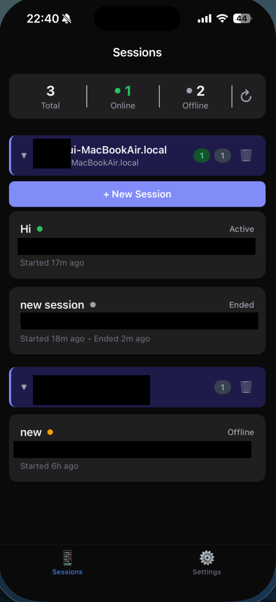
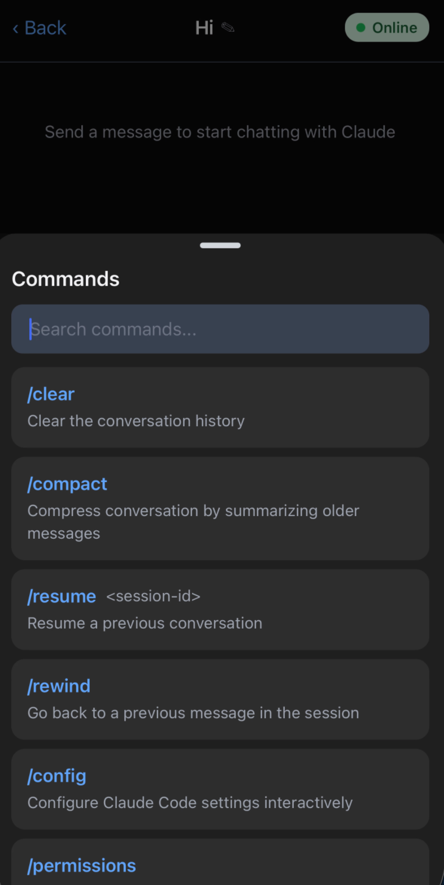
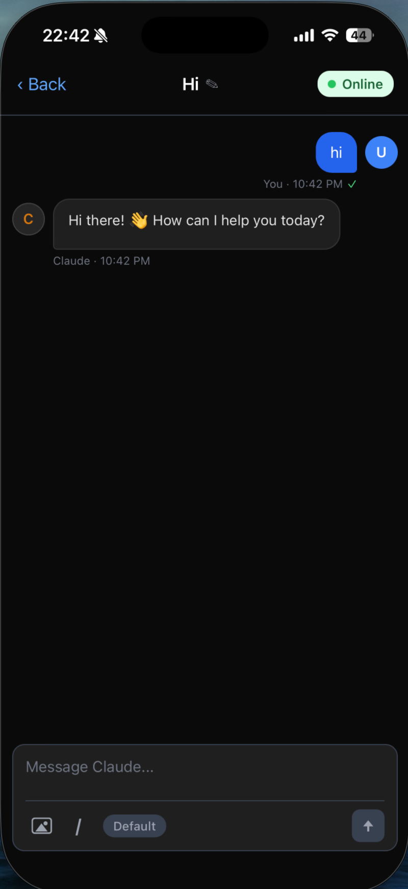

# ClauTunnel

[](https://www.npmjs.com/package/@tongil_kim/clautunnel)
[](https://opensource.org/licenses/MIT)
[](https://www.typescriptlang.org/)
[](https://github.com/TongilKim/ClauTunnel/pulls)

📱 **Remote control for Claude Code CLI from your mobile device.**

Monitor and send inputs to Claude Code terminal sessions in real-time from your iOS or Android device.

---

## Why ClauTunnel?

Running Claude Code on your workstation but need to step away? ClauTunnel lets you keep the conversation going from your phone. Whether you're reviewing a long-running code generation, approving permission prompts, or sending follow-up instructions — you stay in control without being tied to your desk.

## Overview

ClauTunnel allows you to monitor and control Claude Code CLI sessions running on your computer from your iOS or Android device. See terminal output in real-time and send inputs remotely.

## Screenshots

### 📱 Session List

View and manage all your Claude Code sessions at a glance — see which are active, online, or offline.

<p align="center">
    
</p>

### ⚡ Slash Commands

Quickly access powerful commands like /clear, /compact, /resume, /rewind, and /config right from your phone.

<p align="center">
    
</p>

### 💬 Live Chat

Chat with Claude Code in real-time from your mobile device, just like you would from the terminal.

<p align="center">
    
</p>

## Quick Start

```bash
# Install
npm install -g @tongil_kim/clautunnel

# Configure Supabase credentials
clautunnel setup

# Create account (first time) or login (returning user)
clautunnel signup   # new user
clautunnel login    # existing user

# Start listening for mobile connections
clautunnel start
```

Then open the ClauTunnel mobile app via Expo Go (see [Mobile App Setup](#mobile-app-setup)), and you're connected!

## Features

- 📱 Real-time terminal output streaming to mobile
- ⌨️ Send input from mobile to CLI
- 🔄 Automatic reconnection with exponential backoff
- 🌙 Dark mode support
- 🔐 Secure authentication with Supabase

## Tech Stack

- **CLI Wrapper**: Node.js + TypeScript + node-pty
- **Mobile App**: React Native + Expo (iOS & Android)
- **Backend**: Supabase (Realtime, Auth, Database)
- **Monorepo**: pnpm workspaces

<details>
<summary><strong>📁 Project Structure</strong></summary>

```
ClauTunnel/
├── apps/
│   ├── cli/                    # CLI wrapper package
│   │   └── src/
│   │       ├── commands/       # CLI commands (setup, signup, login, start, stop, status)
│   │       ├── daemon/         # Background daemon logic
│   │       ├── realtime/       # Supabase realtime connection
│   │       └── utils/          # Config, logger, prompt, supabase utilities
│   └── mobile/                 # Expo mobile app
│       └── src/
│           ├── components/     # React Native components
│           ├── screens/        # App screens
│           ├── stores/         # Zustand state management
│           └── utils/          # Presence and shared utilities
├── packages/
│   └── shared/                 # Shared types and constants
├── supabase/
│   └── migrations/             # Database schema
└── package.json
```

</details>

## Getting Started

### Prerequisites

- Node.js 18+
- pnpm 8+
- Supabase account

### Installation

**Using npm (Recommended)**

```bash
npm install -g @tongil_kim/clautunnel
```

**Using Homebrew (macOS)**

```bash
brew tap TongilKim/clautunnel
brew install clautunnel
```

**From source**

```bash
# Clone the repository
git clone https://github.com/TongilKim/clautunnel.git
cd clautunnel

# Install dependencies
pnpm install

# Build packages
pnpm build
```

### CLI Setup

After installation, run the setup command to configure your Supabase credentials:

```bash
clautunnel setup
```

This will guide you through two steps:

1. **Supabase Project ID**: Found in Supabase Dashboard → Settings → General → Project ID
2. **Supabase Anon Key**: Found in Supabase Dashboard → Settings → API Keys → Legacy anon Tab → Copy anon key

### Mobile App Setup

The mobile app runs via [Expo Go](https://expo.dev/go) — no app store installation needed.

1. Install **Expo Go** on your phone ([iOS](https://apps.apple.com/app/expo-go/id982107779) / [Android](https://play.google.com/store/apps/details?id=host.exp.exponent))

2. Clone the repository and install dependencies:

```bash
git clone https://github.com/TongilKim/clautunnel.git
cd clautunnel
pnpm install
```

3. Configure credentials (pick one):

**Option A** — Auto-generate from CLI config (requires `clautunnel setup` done first):

```bash
clautunnel mobile-setup
```

**Option B** — Create `.env` manually:

```bash
# apps/mobile/.env
EXPO_PUBLIC_SUPABASE_URL=https://your-project-id.supabase.co
EXPO_PUBLIC_SUPABASE_ANON_KEY=your-anon-key
```

4. Start the mobile app:

```bash
cd apps/mobile
pnpm start
```

5. Scan the QR code with Expo Go (Android) or the Camera app (iOS)

### Supabase Setup

1. Create a new Supabase project
2. Run the database migration:

```bash
supabase db push
```

### CLI Usage

```bash
# First-time setup (configure Supabase credentials)
clautunnel setup

# Create account (first time)
clautunnel signup

# Login (returning user)
clautunnel login

# Logout
clautunnel logout

# Start listening for session requests from mobile
clautunnel start

# Start with a custom machine name
clautunnel start --name "Work Laptop"

# Start with automatic sleep prevention
clautunnel start --prevent-sleep

# Check connection status
clautunnel status

# Stop the running daemon
clautunnel stop
```

### Mobile App

```bash
cd apps/mobile

# Start development server (scan QR with Expo Go)
pnpm start

# Or with tunnel (if phone and computer are on different networks)
pnpm start:tunnel
```

## Development

### Local Development

Run CLI and mobile app in separate terminals:

**Terminal 1 (CLI):**

```bash
cd apps/cli
pnpm start
```

**Terminal 2 (Mobile):**

```bash
cd apps/mobile
pnpm start

# Or with tunnel for different network:
pnpm start:tunnel
```

### Running Tests

```bash
# Run all tests
pnpm test

# Run CLI tests
pnpm --filter @tongil_kim/clautunnel test

# Run mobile tests
pnpm --filter clautunnel-mobile test

# Run shared package tests
pnpm --filter clautunnel-shared test
```

## Architecture

### CLI Flow

1. User runs `clautunnel start`
2. CLI spawns Claude Code process via node-pty
3. CLI creates session in Supabase database
4. PTY output is broadcast to Supabase Realtime channel
5. Mobile app connects to the same channel to receive output
6. Input from mobile is sent via Realtime to CLI
7. CLI writes input to PTY

## Contributing

Contributions are welcome! Please see the [Contributing Guide](CONTRIBUTING.md) for details.

## License

[MIT](LICENSE)
